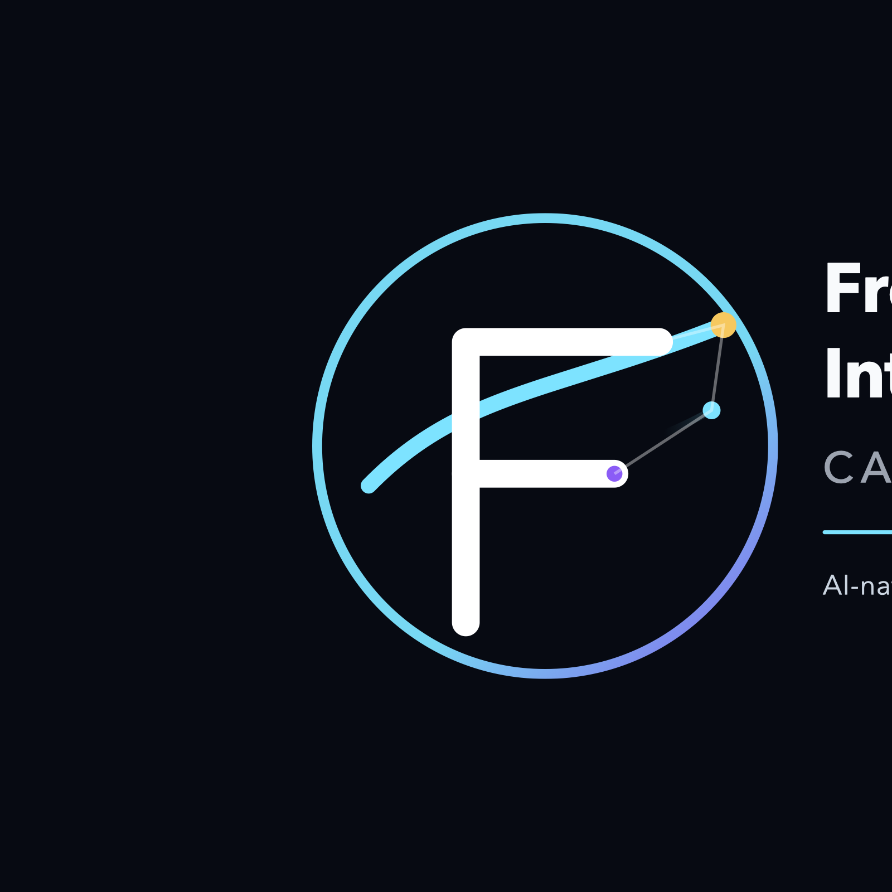

# Frontier Intelligence Capital

AI-native public markets investor focused on technology, productivity, and the changing economics of work.

## Documents

- [Company Manifesto — Investing in the Age of Intelligence](docs/manifesto.md)
- [Investment Thesis — 2026](docs/investment-thesis-2026.md)
- [LinkedIn Identity & Bio](docs/linkedin-identity-bio.md)
- [Brand Notes](docs/brand-notes.md)

## Website

- [Homepage copy](website/copy/homepage.md)

## Logo

Logo files are stored in `assets/logo/`.
